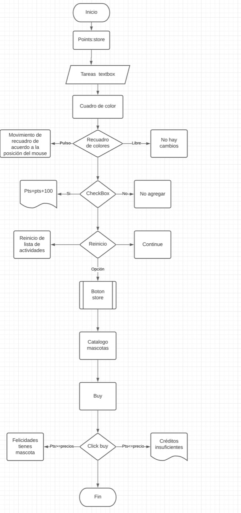

# play it

proyecto que usa la gamificación como parte de la productividad de una persona

https://www.youtube.com/watch?v=UPrp10Auw-o&t=3s

## Funcionamiento

El proceso de input y output del código se puede resumir de la siguiente manera:

El usuario puede introducir varios tipos de inputs:
1. Introducir texto por medio del textbar que se encuentra dentro del recuadro de color
2. Mover el recuadro de color si detecta un click sobre el mismo (primer input)mediante la posición de tu cursor (segundo input) 
3. Reiniciar la lista de actividades y agregar puntaje mediante el checkbox de la esquina superior del recuadro de color
4. Abrir la tienda mediante el boton de la esquina superior de la pantalla 

El programa puede tener los siguientes outputs:
1. Aumento en el puntaje del usuario
2. Reiniciar la lista de actividades
3. Abrir la tienda y comprar la mascota

## Diagrama de Flujo

## Diccionario

const cuadrado = Cuadrado de color que se muestra en la aplicación
const textbox = Textbox que se encuentra dentro del cuadrado de color
const boton = boton para agregar nuevas entradas
const n_element = constante donde se guardan las nuevas entradas
const reset = boton para reiniciar la lista
const points = contador del puntaje
const store = boton para iniciar la tienda
const sub_container = contenedor dentro del cuadrado de color

